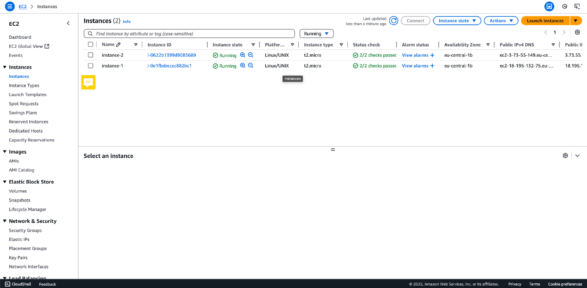
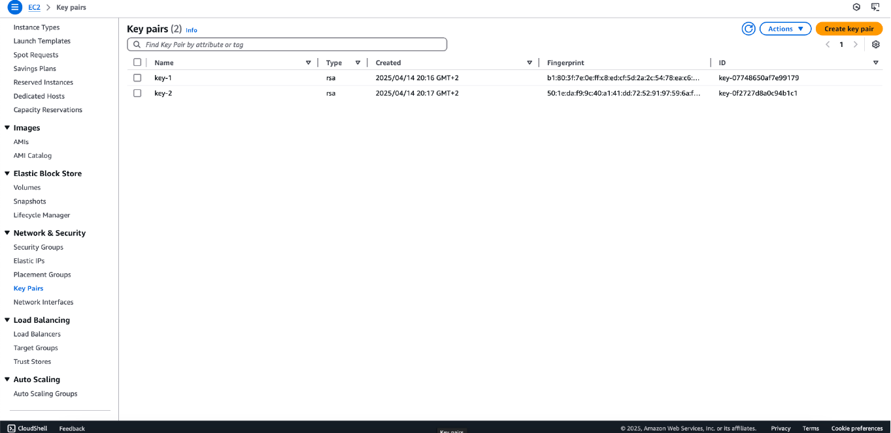
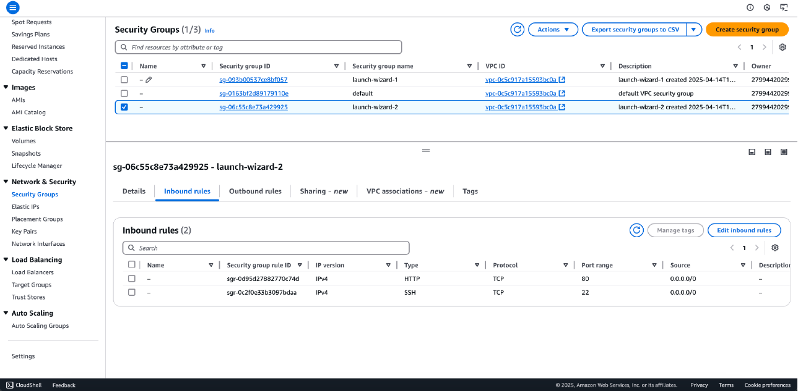
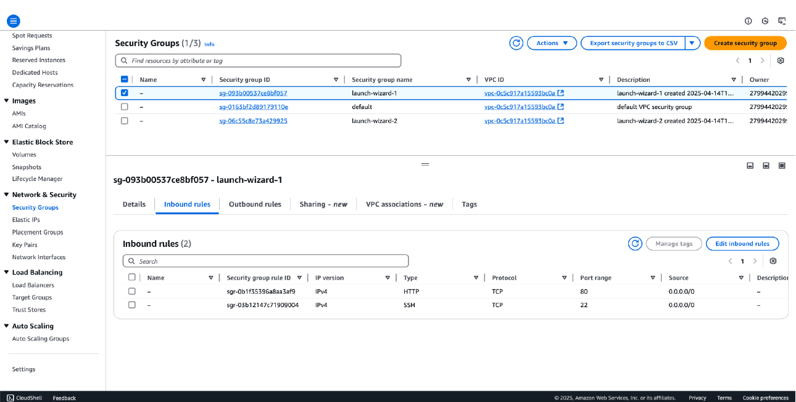
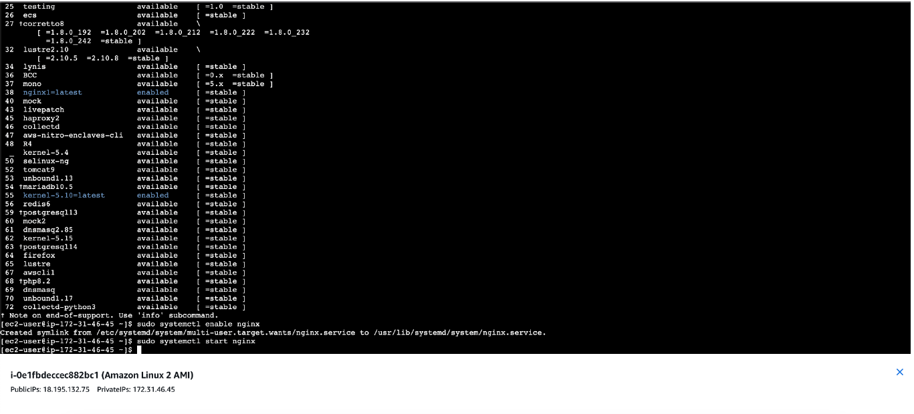
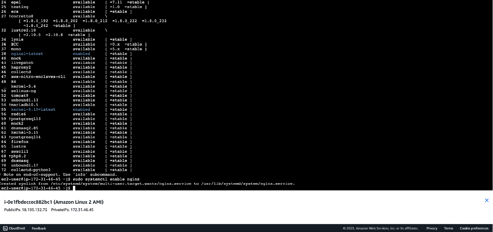
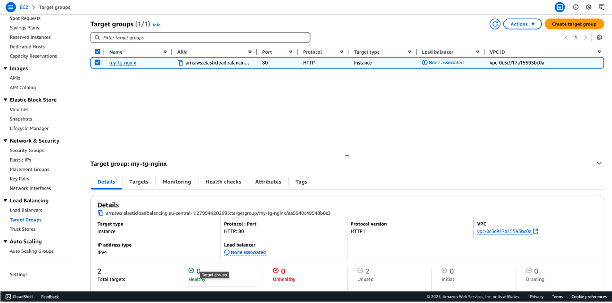
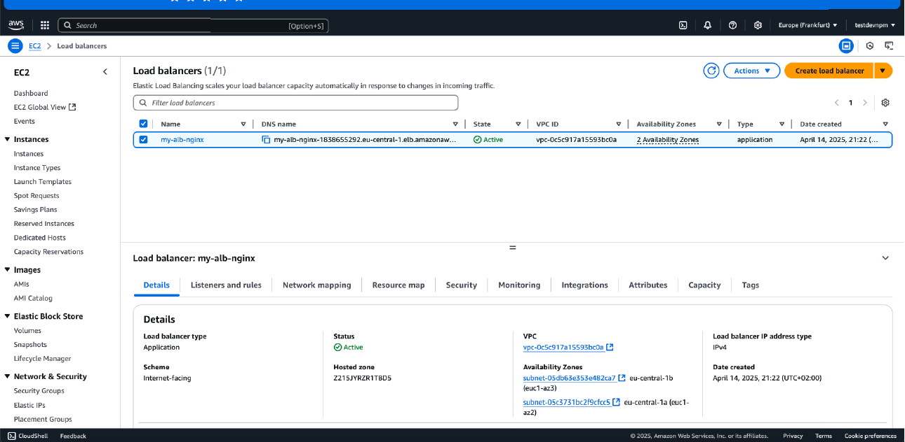
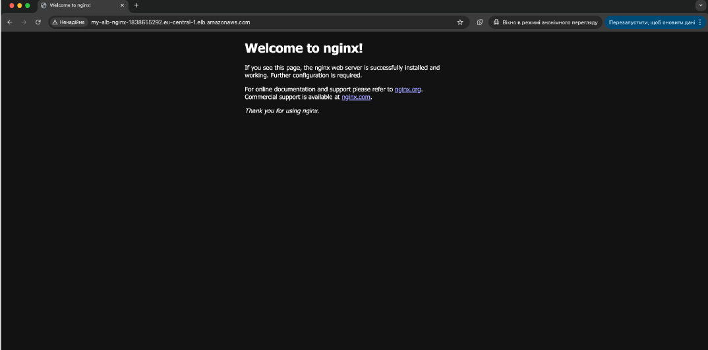
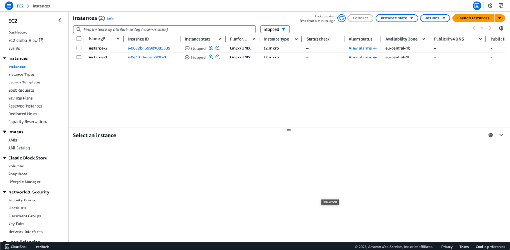

# AWS Highly Available Web Architecture & Security Lab

[📄 Download Lab Report as PDF](./pdf/AWS-ALB-EC2-Laboratory-Work.pdf)

## 📌 Project Overview
The objective of this laboratory work is to design, provision, and secure a highly available web infrastructure using Amazon Web Services (AWS). This project demonstrates the practical implementation of core cloud networking, compute virtualization, and load-balancing technologies, with a strong emphasis on cybersecurity best practices, identity management, and attack surface reduction.

**Tech Stack:** AWS EC2, Amazon Linux 2, Application Load Balancer (ALB), Nginx, Security Groups (Virtual Firewalls), SSH/RSA Cryptography.

---

## Step 1: Provisioning EC2 Instances

**Technical Overview:**
In this step, I deployed two virtual servers using **Amazon EC2 (Elastic Compute Cloud)**. These instances serve as the foundational infrastructure for the lab environment.

* **AMI (Amazon Machine Image):** Amazon Linux 2 (Chosen for its stability and integration with AWS tools).
* **Instance Type:** `t2.micro` (Bursting capabilities, ideal for low-utilization workloads and Free Tier eligibility).
* **Region/AZ:** `eu-central-1b` (Frankfurt).



**Security & Operational Note:**
During the provisioning process, I ensured that both instances were launched within a specific **VPC (Virtual Private Cloud)**. It is crucial to highlight that these instances are monitored via **Status Checks**. As seen in the screenshot, both instances show "2/2 checks passed," confirming that the system is reachable and the underlying hardware is functional.

> **Pro-Tip for Portfolio:** In a real-world cybersecurity scenario, these instances would be protected by **Security Groups** acting as virtual firewalls, strictly controlling inbound and outbound traffic via protocols like SSH (TCP 22) or HTTP (TCP 80).

---

## Step 2: Key Pair Management and Secure Access Control

**Technical Overview:**
To enable secure remote access to the EC2 instances, I generated **RSA Key Pairs**. AWS uses public-key cryptography to encrypt and decrypt login information.

* **Key Type:** `RSA` (standard encryption algorithm).
* **Format:** `.pem` (Private Key for OpenSSH).
* **Fingerprint Verification:** Each key is assigned a unique fingerprint to ensure the integrity of the key being used for the connection.



**Security & Best Practices:**
From a **Cybersecurity** perspective, managing key pairs is the first line of defense. During this lab, I followed the "Principle of Least Privilege" by creating dedicated keys for specific instances:

1. **Private Key Storage:** The private key (`.pem` file) is stored locally on a secure machine and was never uploaded to the repository or shared publicly.
2. **Permissions (chmod 400):** Before connecting via SSH, I ensured the private key file has restricted permissions to prevent unauthorized access by other users on the local system.
3. **Authentication:** AWS stores the **public key** on the instance, while I retain the **private key**. Authentication is only possible when these two halves match.

> **Security Note:** In a production environment, it is highly recommended to use **AWS Systems Manager (SSM) Session Manager** to connect to instances without needing to open SSH port 22 or manage SSH keys manually.

---

## Step 3: Configuring Network Security Groups (Firewall Rules)

**Technical Overview:**
In AWS, a **Security Group** acts as a virtual firewall for EC2 instances to control incoming and outgoing traffic. For this environment, I configured specific **Inbound Rules** to allow necessary operational and web traffic while denying all other unsolicited requests by default.




**Configuration Details:**
I defined two primary rules within the security groups:
* **SSH (Secure Shell):** Port `22` / Protocol `TCP`. This allows for secure remote administration of the Linux instances via the command line.
* **HTTP (Hypertext Transfer Protocol):** Port `80` / Protocol `TCP`. This enables the instances to serve web content to users over the internet.
* **Source:** `0.0.0.0/0` (In this lab setting, traffic is accepted from any IP address to ensure connectivity).

**Cybersecurity Analysis & Best Practices:**
While the current configuration uses `0.0.0.0/0` for accessibility, a production-ready security posture would implement the following enhancements:
1. **IP Whitelisting:** For SSH access (Port 22), the source should be restricted to a specific IP address (e.g., Corporate VPN).
2. **Stateful Inspection:** Security groups in AWS are **stateful**. This means if an inbound request is allowed, the outbound response is automatically permitted.
3. **Default Deny:** Following the "Zero Trust" model, all traffic not explicitly defined in these rules is blocked by default.

---

## Step 4: Establishing Secure Remote Access via SSH

**Technical Overview:**
With the infrastructure provisioned and security groups configured, I proceeded to establish a secure remote session utilizing **EC2 Instance Connect**, a browser-based SSH tool.



**Execution Details:**
* **Authentication:** The session successfully authenticated using the previously generated Key Pair.
* **Environment:** Upon login, the terminal confirms the use of **Amazon Linux 2**.
* **Network Validation:** The successful connection validates that Port 22 is correctly opened in the Security Group.

**System Updates and Environment Preparation:**
Before deploying any applications, I synchronized the package database and prepared the system for software installation:
```bash
sudo yum update -y
```

---

## Step 5: Web Server Provisioning and Service Management (Nginx)

**Technical Overview:** To demonstrate the instance's capability to host and serve web content, I deployed Nginx, an industry-standard, high-performance web server and reverse proxy. Because the environment runs on Amazon Linux 2, I utilized the amazon-linux-extras repository to install a curated, stable version of the software specifically optimized for AWS.

**Execution Details:** I executed the following sequence of commands to install the package, ensure service persistence, and initialize the web server:

```bash
# Install Nginx using the Amazon Linux Extras package manager
sudo amazon-linux-extras install nginx -y

# Configure the Nginx service to start automatically upon system boot
sudo systemctl enable nginx
# Start the Nginx service for the current session
sudo systemctl start nginx
```

**Cybersecurity & Operations Analysis:** In a professional cloud environment, simply installing software is not enough; it must be configured for resilience and security.

1. **Service Persistence (systemctl enable):** Enabling the daemon ensures that if the EC2 instance reboots—whether due to routine automated patching, system crashes, or AWS hardware maintenance—the web server will automatically come back online. This is a fundamental practice for maintaining High Availability (HA).
2. **Privilege Management (sudo):** The Nginx master process requires root privileges (sudo) to bind to privileged network ports (like TCP Port 80 for HTTP). However, according to security best practices, Nginx is designed to drop these root privileges immediately after binding, running its worker processes under a low-privileged user account (e.g., nginx). This minimizes the blast radius if the web server is compromised.
3. **Completing the Network Path:** Starting this service actively binds the server to Port 80. This perfectly aligns with the Security Group inbound rules configured in Step 3, finally allowing the instance to accept and respond to external web traffic.



---

## Step 6: Verifying Web Server Operation and Public Access

**Technical Overview:** To validate the entire configuration stack—from EC2 provisioning and Security Group routing to service initialization—I performed an external connectivity test. This involved accessing the instance over the public internet using its Public IPv4 DNS.

**Execution Details:** By navigating to the instance's public address via a standard web browser, I successfully received the "Welcome to nginx!" default landing page. This confirms:

1. **DNS Resolution:** The AWS-provided public DNS correctly resolves to the instance's underlying IP.
2. **Inbound Routing:** The Security Group successfully permitted external inbound traffic on TCP Port 80.
3. **Service Availability:** The Nginx daemon is actively listening and responding to HTTP GET requests.

**Cybersecurity Analysis & Hardening Recommendations:** While this step proves the server is functional, a security-conscious engineer must address the risks associated with default configurations:

* **Information Disclosure:** Displaying the default Nginx page gives potential attackers exact knowledge of the underlying web server technology. Best Practice: In a production environment, this default page should be removed or replaced, and server version banners should be hidden by setting `server_tokens off;` in the `nginx.conf` file to thwart automated reconnaissance scanning.
* **Unencrypted Transit:** The current connection is established over HTTP (Port 80), meaning traffic is transmitted in plaintext. Best Practice: The next architectural step would involve provisioning an SSL/TLS certificate (e.g., via AWS Certificate Manager or Let's Encrypt) and enforcing redirection to HTTPS (Port 443) to protect against Man-in-the-Middle (MITM) attacks.


---

## Step 7: Configuring Target Groups for Load Balancing

**Technical Overview:** To prepare the infrastructure for high availability and traffic distribution, I navigated to the Load Balancing section and established a Target Group. A Target Group serves as a logical grouping of underlying resources (in this case, the EC2 instances) that will eventually receive traffic from an Elastic Load Balancer (ELB).

**Execution Details:**

* **Target Group Name:** `my-tg-nginx`
* **Target Type:** Instance (Traffic is routed directly to the specified EC2 instances).
* **Protocol & Port:** HTTP: 80 (Aligning with the Nginx web servers provisioned in earlier steps).
* **Target Status Analysis:** As shown in the documentation, the current status of the two registered targets is "Unused". This is the expected behavior at this stage, indicating that the targets are successfully registered, but the Target Group has not yet been attached to an active Load Balancer node to begin routing traffic.

**Cybersecurity & Architectural Analysis:** Implementing a Target Group is a critical step toward a robust Defense in Depth architecture:

1. **Health Checks & Availability (CIA Triad):** Target Groups continuously monitor the health of registered instances. If an instance becomes unresponsive or compromised, the Load Balancer automatically stops routing external traffic to it, ensuring continuous system availability.
2. **Traffic Abstraction:** By placing instances behind a Load Balancer and a Target Group, the internal architecture is abstracted from the public internet. External users never communicate directly with the backend servers.
3. **Future Hardening:** Once the Load Balancer is deployed, the EC2 Security Groups (configured in Step 3) can be heavily restricted. Instead of allowing 0.0.0.0/0 (everyone) on Port 80, the inbound rules will be modified to only accept traffic originating from the Load Balancer's specific Security Group, effectively eliminating direct public access to the instances.



---

## Step 8: Deploying an Application Load Balancer (ALB)

**Technical Overview:** To effectively distribute incoming HTTP traffic across the provisioned EC2 instances and ensure high availability, I deployed an Application Load Balancer (ALB). The ALB operates at Layer 7 of the OSI model, making intelligent routing decisions based on the content of the request, and connects directly to the Target Group established in the previous step.

**Execution Details:**

* **Load Balancer Name:** `my-alb-nginx`
* **Scheme:** Internet-facing (Configured with a publicly resolvable DNS name to act as the single entry point for external users).
* **State:** Active
* **Multi-AZ Deployment:** As highlighted in the configuration, the ALB spans across multiple Availability Zones (eu-central-1a and eu-central-1b).

**Cybersecurity & Cloud Architecture Analysis:** Introducing an ALB fundamentally shifts the security posture and resilience of the web application:

1. **High Availability & Fault Tolerance:** By distributing traffic across multiple Availability Zones (distinct physical data centers), the architecture can survive a complete failure of a single zone. If one EC2 instance or entire AZ goes offline, the ALB automatically reroutes traffic to healthy instances in the remaining zone.
2. **Backend Obscurity (Topology Hiding):** External clients no longer communicate directly with the EC2 instances. The ALB acts as a reverse proxy, hiding the underlying internal IP addresses and network topology from the public internet.
3. **DDoS Mitigation:** AWS Load Balancers automatically benefit from AWS Shield Standard, providing inherent protection against common volumetric Distributed Denial of Service (DDoS) attacks.
4. **Centralized Security Control:** In a production environment, the ALB serves as the ideal attachment point for AWS WAF (Web Application Firewall) to filter malicious Layer 7 requests (like SQL injection or Cross-Site Scripting) before they ever reach the EC2 instances.

**Security Hardening Next Step:** With the ALB active, the final architectural security step is to modify the EC2 Security Groups. The inbound rule allowing HTTP (0.0.0.0/0) on the instances should be deleted. Instead, the rule should be updated to only accept traffic originating from the ALB's specific Security Group. This ensures that attackers cannot bypass the Load Balancer to target the servers directly.



---

## Step 9: Validating Load Balancer Traffic Routing and Access

**Technical Overview:** To confirm the successful end-to-end deployment of the highly available architecture, I tested the external connectivity by navigating to the Application Load Balancer's (ALB) Public DNS name in a web browser.

**Execution Details:** By accessing `my-alb-nginx-....eu-central-1.elb.amazonaws.com`, the browser successfully displayed the Nginx landing page. This confirms several critical architectural success criteria:

1. **DNS Resolution:** The ALB's DNS is publicly resolvable and operational.
2. **Traffic Proxying:** The ALB is successfully receiving the inbound HTTP request and intelligently routing it to a healthy EC2 instance within the Target Group.
3. **Backend Health:** The Target Group health checks are passing, meaning the Nginx service on the EC2 instances is ready to handle traffic.

**Cybersecurity Analysis & Production Hardening:** As an aspiring security professional, analyzing the final state reveals several areas for production-level hardening. As seen in the browser's address bar, the connection is marked as "Not secure" because the traffic is transmitted via plaintext HTTP.

In a real-world, enterprise-grade deployment, I would implement the following security enhancements:

1. **SSL/TLS Termination at the ALB:** I would request an SSL certificate via AWS Certificate Manager (ACM) and attach it to an HTTPS listener on the ALB. This centralizes certificate management and offloads the cryptographic decryption workload from the backend EC2 instances.
2. **HTTP to HTTPS Redirection:** The HTTP listener (Port 80) on the ALB would be reconfigured to strictly redirect all traffic to the HTTPS listener (Port 443).
3. **Private Subnets for Compute:** Currently, the EC2 instances have Public IPs. With the ALB fully functional, the next architectural iteration would involve moving the EC2 instances to Private Subnets, removing their Public IPs entirely. External users would only be able to interact with the ALB, effectively shielding the underlying compute infrastructure from direct internet-based attacks.



---

## Step 10: Resource Suspension and Incident Response Forensics

**Technical Overview:** To conclude the laboratory exercise and adhere to strict cloud management best practices, I transitioned the EC2 instances from a Running to a Stopped state via the EC2 Management Console.

**Execution Details:**

* **Target Resources:** instance-1 and instance-2.
* **Action Performed:** Instance State -> Stop instance.
* **Network Impact:** As highlighted in the screenshot, upon stopping the instances, AWS automatically released their ephemeral Public IPv4 DNS and IP addresses back to the underlying pool.

**Cybersecurity & Cloud Governance Analysis:** While in this lab the goal was cost optimization, stopping instances has profound implications in real-world cybersecurity operations:

1. **Attack Surface Reduction:** By stopping the instances, all compute processes (including the Nginx web servers) are halted, and the public endpoints are destroyed. The instances are mathematically unreachable from the internet, completely eliminating their attack surface while in this state.
2. **Digital Forensics and Incident Response (DFIR):** In the event of a suspected security breach (e.g., malware infection or unauthorized access), the standard containment protocol is to isolate and stop the compromised EC2 instance rather than terminating it. Stopping the instance halts the malicious activity but preserves the Elastic Block Store (EBS) volume. Security analysts can then attach this volume to an isolated forensic workstation to investigate the root cause, analyze logs, and extract indicators of compromise (IoCs) without destroying the evidence.
3. **Cloud FinOps (Financial Operations):** Leaving unused resources running is a primary target for attackers deploying cryptojacking malware. Routine suspension of non-production environments mitigates the risk of billing anomalies caused by compromised compute resources.

