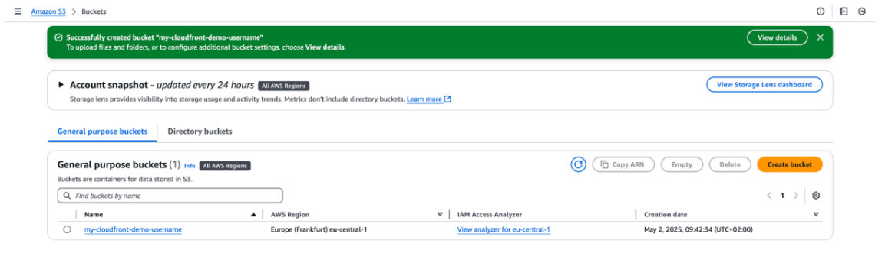
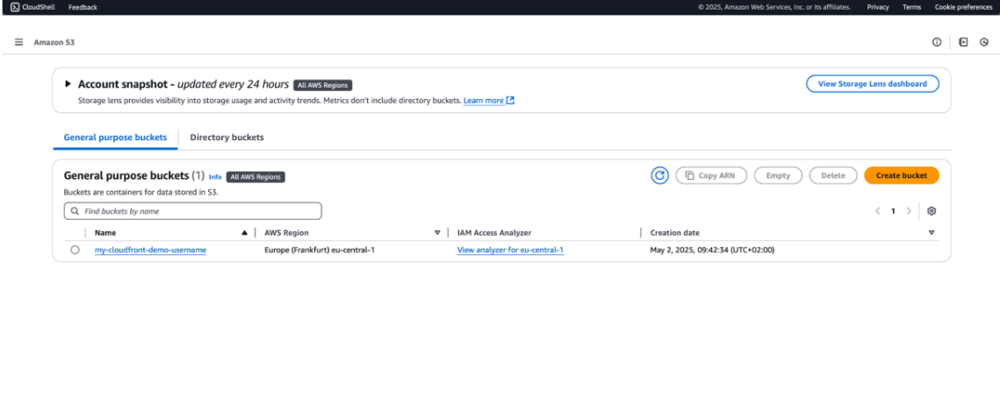
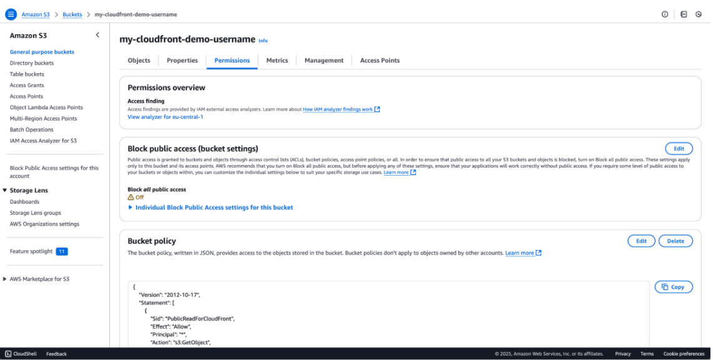
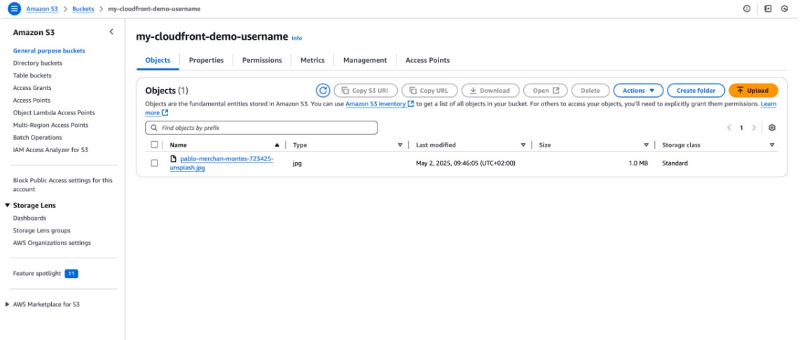
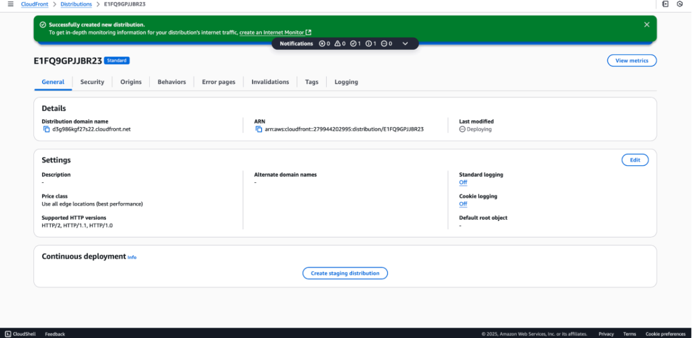
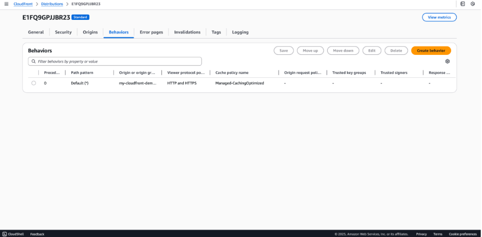
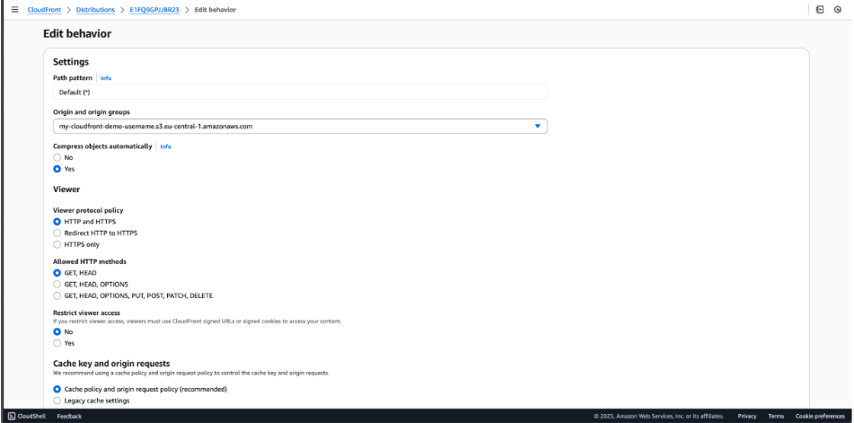
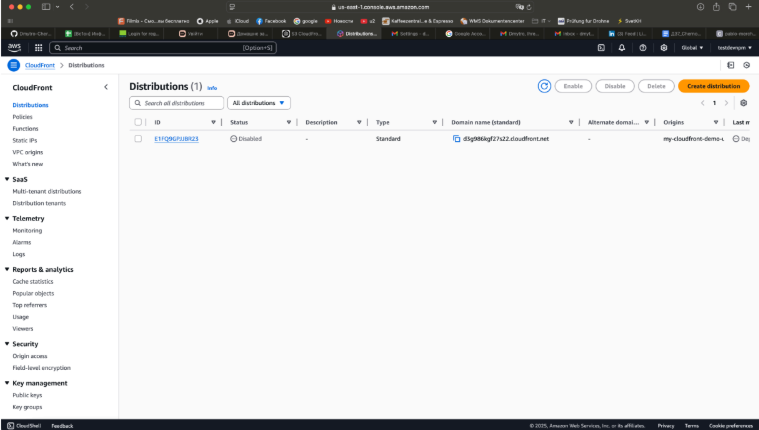
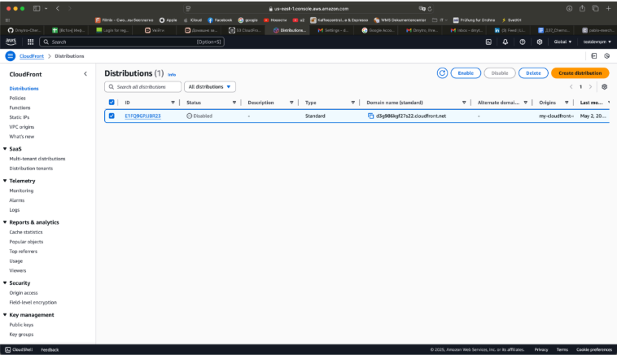
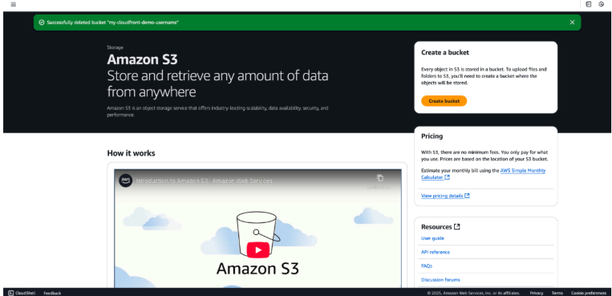

# AWS Highly Available Web Architecture & Security Lab

[📄 Download Lab Report as PDF](./pdf/AWS-CloudFront-S3-CDN.pdf)

# AWS Cloud Lab: Secure Content Delivery with Amazon CloudFront and S3

## **Step 1: Provisioning the Amazon S3 Bucket**
The first phase of this infrastructure deployment involves creating an Amazon S3 (Simple Storage Service) bucket. In this lab, the bucket serves as the Origin for a CloudFront distribution, providing a scalable and durable storage solution for web content.

### **Technical Implementation:**
* **Bucket Name:** `my-cloudfront-demo-username` (Must be globally unique and DNS-compliant).
* **Region:** `eu-central-1` (Frankfurt). Choosing a region close to the target audience or compliant with data residency regulations is a key architectural decision.
* **Bucket Type:** General Purpose.

### **Cybersecurity Best Practices (Professional Insight):**
1. **Block Public Access (BPA):** By default, S3 buckets should have "Block all public access" enabled. This prevents accidental data exposure—one of the most common causes of cloud data breaches.
2. **Principle of Least Privilege (PoLP):** Access to this bucket is strictly managed via IAM (Identity and Access Management) roles and Bucket Policies, ensuring only authorized services (like CloudFront via OAC/OAI) can retrieve the data.
3. **Encryption:** For a production-ready environment, I would enable SSE-S3 or SSE-KMS to ensure data is encrypted at rest.

*Screenshot 1: The provisioned S3 bucket in the AWS Management Console.*

---

## **Step 2: Configuring S3 Public Access and Bucket Policy**
To allow Amazon CloudFront to retrieve and serve content from the S3 origin, the bucket permissions must be configured to permit read access. This step involves adjusting the "Block Public Access" settings and defining a granular JSON bucket policy.

### **Technical Implementation:**
1. **Adjusting Block Public Access (BPA):** Navigated to the Permissions tab of the bucket. Disabled the "Block all public access" setting. This is a prerequisite for applying a bucket policy that allows external read access.
2. **Defining the Bucket Policy:** Applied a JSON-based resource policy to grant `s3:GetObject` permissions.
   * **Effect:** Allow 
   * **Principal:** `*` (Configured for public read access in this lab environment).
   * **Resource:** `arn:aws:s3:::my-cloudfront-demo-username/*`

### **Cybersecurity Perspective: Risk Assessment & Mitigation**
In a real-world production environment, disabling "Block Public Access" is generally considered a high-risk configuration. 
* **The Risk:** Using a wildcard principal (`*`) in a bucket policy can lead to unauthorized data exposure if not managed correctly.
* **Professional Best Practice (The "Pro" Move):** For a production-grade deployment, I would implement Origin Access Control (OAC). This allows the bucket to remain private (with "Block Public Access" enabled) while granting access only to the specific CloudFront distribution service principal. This adheres to the Principle of Least Privilege (PoLP) and prevents users from bypassing the CDN to access the origin directly.

*Screenshot 2: Adjusting S3 Block Public Access and Bucket Policy configurations.*

---

## **Step 3: Object Ingestion and Asset Management**
With the bucket infrastructure and permissions in place, the next phase is the ingestion of static assets. This step demonstrates the ability to manage objects within the S3 environment that will eventually be served through a Content Delivery Network (CDN).

### **Technical Implementation:**
* **Action:** Successfully uploaded a sample asset (Image file: `pablo-merchan-montes...jpg`).
* **Storage Class:** Assigned to S3 Standard. This class provides 99.999999999% (11 nines) of durability, making it ideal for high-availability web content.

### **Cybersecurity & Governance:**
1. **Data Integrity (Checksums):** To ensure that the file was not corrupted or tampered with during the upload process, I utilize the ETag (MD5 hash) or provide a SHA-256 checksum. This guarantees the integrity of the source data.
2. **Metadata Scrubbing:** Before uploading public-facing assets, it is a best practice to strip sensitive EXIF metadata (such as GPS coordinates or camera serial numbers) to prevent information leakage to potential attackers.
3. **Versioning & Immutability:** In a production setup, I would enable S3 Versioning or Object Lock. This provides a defense-in-depth layer against ransomware or accidental deletion by keeping a history of objects or making them "WORM" (Write Once, Read Many).

*Screenshot 3: The uploaded static asset successfully stored in the S3 bucket.*

---

## **Step 4: Provisioning an Amazon CloudFront Distribution**
To deliver the content stored in the S3 bucket securely and with low latency, I provisioned an Amazon CloudFront Distribution. This creates a global Content Delivery Network (CDN) that caches content at Edge Locations, reducing the load on the origin server and improving the end-user experience.

### **Technical Implementation:**
* **Distribution Domain Name:** `d3g986kgf27s22.cloudfront.net` (The secure endpoint for users).
* **Price Class:** Use all edge locations (best performance). This ensures the lowest possible latency by utilizing AWS's global network of Points of Presence (PoPs).
* **Supported Protocols:** Enabled HTTP/2, HTTP/1.1, and HTTP/1.0 to ensure broad compatibility while optimizing performance for modern, secure browsers.

### **Cybersecurity Highlights (Infrastructure Hardening):**
1. **DDoS Mitigation (AWS Shield Standard):** By using CloudFront, this infrastructure is automatically protected by AWS Shield Standard. This provides always-on detection and automatic inline mitigations against common Layer 3 and 4 infrastructure attacks.
2. **Encryption in Transit:** CloudFront is configured to enforce HTTPS, ensuring that data transferred between the end-user and the Edge Location is encrypted using modern TLS protocols.
3. **Reducing the Attack Surface:** By directing all traffic through CloudFront, I can effectively hide the direct S3 bucket URL from the public internet. This ensures that the origin is not directly exposed to potential attackers.
4. **WAF Integration Readiness:** This distribution is designed to integrate seamlessly with AWS WAF (Web Application Firewall). In a production scenario, I would implement custom WAF rules to filter out malicious traffic, such as SQLi or XSS, at the edge before it reaches the source.

*Screenshot 4: The active Amazon CloudFront Distribution settings and domain name.*

---

## **Step 5: Configuring Cache Behaviors and Access Control**
The Behavior settings in CloudFront act as the traffic controller for the distribution. By fine-tuning these settings, I ensured that the delivery of content is both highly performant and strictly controlled according to the Principle of Least Privilege.

### **Technical Implementation:**
* **Allowed HTTP Methods:** Restricted to `GET, HEAD`. This is a deliberate security choice to prevent unauthorized users from attempting state-changing operations (like POST, PUT, or DELETE) at the edge.
* **Cache Policy:** Implemented the `Managed-CachingOptimized` policy. This optimizes the Time-To-Live (TTL) settings, ensuring that content is cached effectively at Edge Locations to minimize latency and reduce origin (S3) costs.
* **Viewer Protocol Policy:** Currently set to HTTP and HTTPS for initial testing, with the recommendation to enforce `Redirect HTTP to HTTPS` for production hardening.

### **Cybersecurity Analysis: Method Filtering & Origin Protection**
1. **Method Whitelisting:** By restricting allowed methods to only `GET` and `HEAD`, I have effectively eliminated entire classes of web-based attacks that rely on other HTTP verbs.
2. **Origin Shielding:** CloudFront acts as a buffer. Even if a malicious actor attempts to flood the site with requests, the `CachingOptimized` policy ensures that most traffic is served from the AWS global cache, preventing the S3 origin from being overwhelmed or incurring massive costs.

*Screenshot 5: Configuring Cache Behaviors and HTTP method restrictions.*

---

## **Step 5.1: Final Verification (System Integration Test)**
To verify the end-to-end integration, I accessed the static asset using the unique CloudFront Domain Name.

* **Success URL:** `https://d3g986kgf27s22.cloudfront.net/pablo-merchan-montes-723425-unsplash.jpg` 
* **Outcome:** The asset was successfully retrieved and rendered via the global CDN, confirming that the S3 Bucket Policy, CloudFront Origin settings, and Cache Behaviors are correctly synchronized.

---

## **Step 6: Resource Decommissioning and Environment Cleanup**
The final phase of the cloud lifecycle is the secure decommissioning of resources. Proper cleanup is a critical skill in cloud management, ensuring that no "ghost" resources remain active, which could lead to unnecessary costs or security vulnerabilities.

### **Technical Implementation:**
1. **CloudFront Distribution Cleanup:**
   * Transitioned the distribution to a `Disabled` state. AWS requires a distribution to be disabled before it can be deleted to prevent accidental service disruption.
   * Once disabled, the distribution was permanently deleted from the AWS global network.
2. **Amazon S3 Bucket Cleanup:**
   * Emptied the `my-cloudfront-demo-username` bucket. S3 prevents the deletion of non-empty buckets as a data loss prevention measure.
   * Successfully deleted the bucket infrastructure.

### **Cybersecurity & Operational Excellence:**
* **Cost Optimization (FinOps):** Effective cloud security includes financial security. By promptly removing resources after a lab or project, I demonstrate an understanding of the Pay-as-you-go model and responsible budget management.
* **Reducing the Attack Surface:** Every active endpoint is a potential entry point for an attacker. Removing unused distributions and buckets is a key part of Security Hygiene—if a resource doesn't exist, it cannot be compromised.
* **Stale Resource Management:** Deleting resources prevents "Shadow IT" or stale environments that might be forgotten and left unpatched or unmonitored over time.

*Screenshot 7: Successfully deleting the S3 bucket and disabling the CloudFront distribution.*