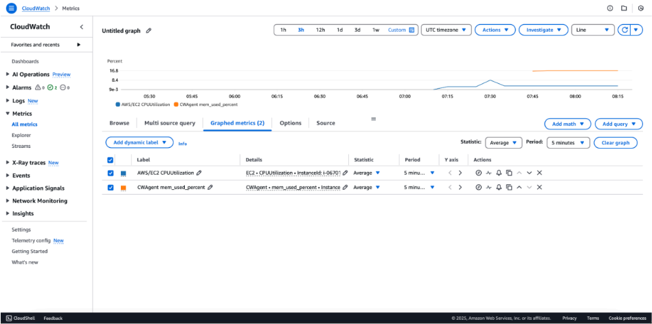
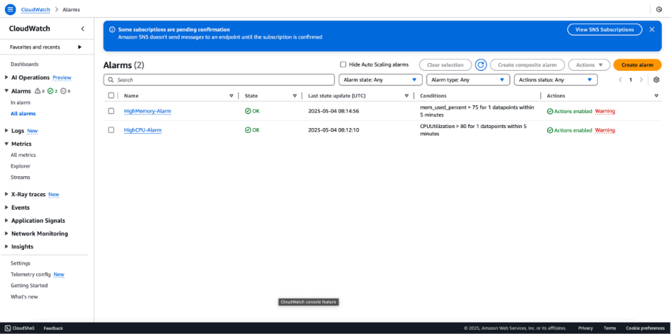
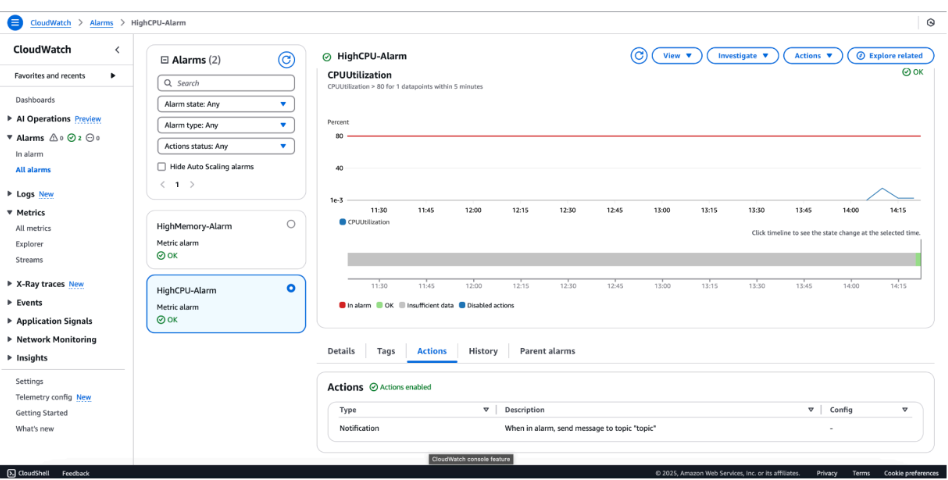
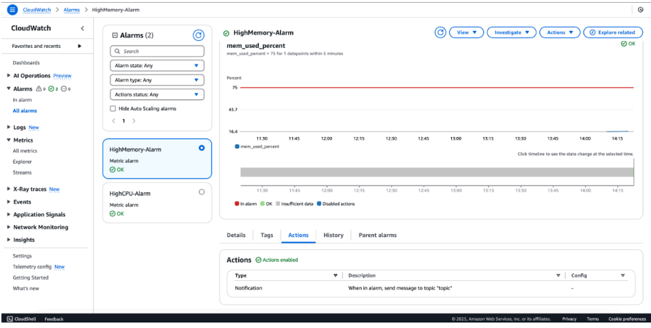
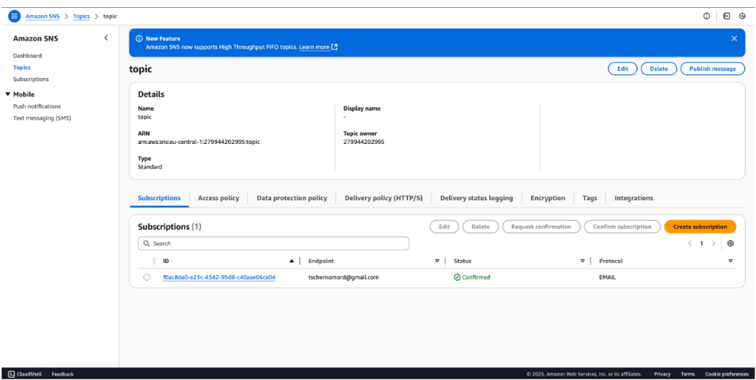
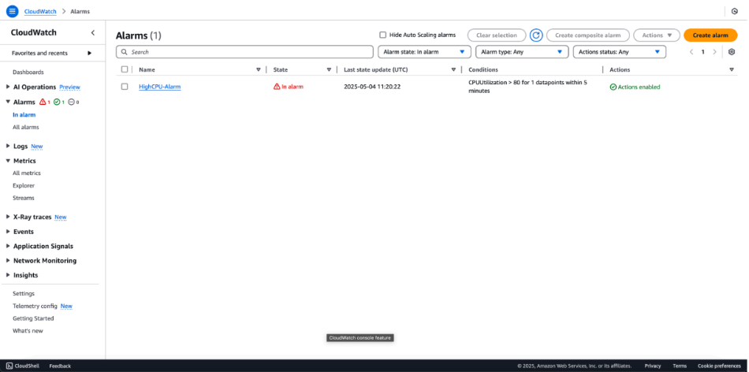
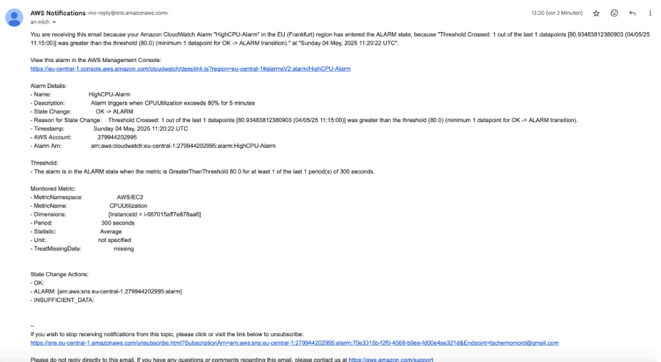
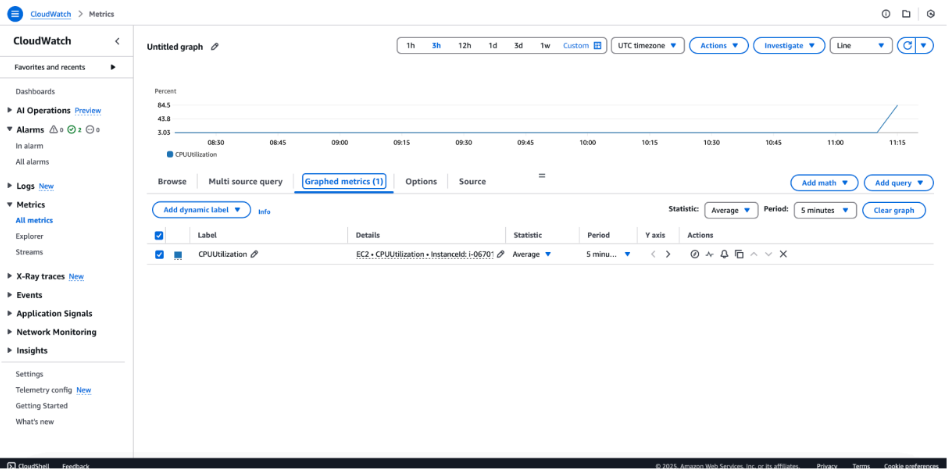
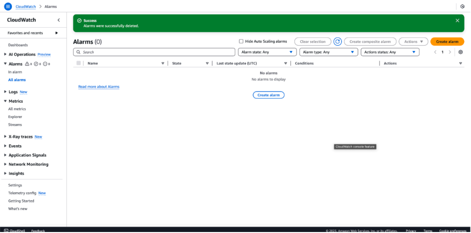
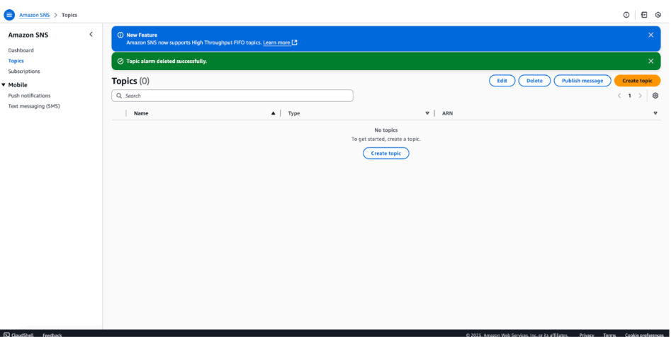

[📄 Download Lab Report as PDF](./pdf/AWS-CloudWatch-SNS-Monitoring.pdf)

# AWS Cloud Lab: Resource Monitoring and Automated Alerting with CloudWatch and SNS

This document details the deployment of a robust monitoring and incident notification pipeline in AWS. The project focuses on real-time resource tracking, proactive threat detection via automated alarms, and system stress testing to validate operational readiness.

---

## **Step 1: Implementing Resource Monitoring via AWS CloudWatch**
### **Technical Overview**
In this phase, I configured comprehensive monitoring for the EC2 instance to ensure operational visibility and security baseline auditing. By utilizing Amazon CloudWatch, I gained real-time insights into system performance and resource consumption.

### **Key Metrics Monitored:**
* **CPU Utilization:** Tracks the processing load on the instance. Significant spikes may indicate a potential Denial of Service (DoS) attempt or an inefficient process that needs optimization.
* **Memory Utilization (via CloudWatch Agent):** Unlike CPU, memory metrics are not collected by default at the hypervisor level. I deployed the CloudWatch Agent on the instance to push custom OS-level metrics, providing a deeper view of the system's health.


*Screenshot 1: Amazon CloudWatch dashboard displaying CPU and Custom Memory utilization metrics.*

---

## **Step 2: Proactive Threat Detection with CloudWatch Alarms**
### **Technical Overview**
While monitoring provides visibility, effective cloud operations require proactive detection. In this step, I transitioned from passive monitoring to automated alerting by configuring CloudWatch Alarms based on critical performance and security baselines.

### **Security Baselines and Alerts Configured:**
1. **High CPU Utilization Alarm:**
   * **Threshold:** > 80% sustained for 5 consecutive minutes.
   * **Rationale:** Detects sustained high-load situations. This is a critical early warning for potential resource-exhaustion attacks (like DDoS) or unauthorized cryptocurrency mining (cryptojacking).
2. **High Memory Utilization Alarm:**
   * **Threshold:** > 75% sustained for 5 consecutive minutes.
   * **Rationale:** Sustained high memory usage is a critical indicator of a memory leak or a sophisticated buffer overflow attempt, allowing security teams to intervene before a system crash.

**Integrated Notification Layer:** These alarms are linked to an Amazon SNS topic, ensuring that when an alarm is triggered, an automated email notification is dispatched to the operational team.


*Screenshot 2: CloudWatch Alarms configured for High CPU and High Memory utilization.*

---

## **Step 3: Orchestrating Real-Time Incident Notifications via Amazon SNS**
### **Technical Overview**
To ensure immediate awareness of potential security or performance issues, I integrated Amazon Simple Notification Service (SNS) with the CloudWatch Alarms. This creates an automated notification pipeline that bridges the gap between detection and manual or automated intervention.

### **Implementation Details:**
* **SNS Topic Creation:** Created a dedicated SNS topic to serve as a centralized hub for all resource-related alerts.
* **Protocol Configuration:** Configured an Email Protocol subscription to ensure critical alerts are pushed directly to the security analyst's inbox.
* **Subscription Validation:** Confirmed the subscription to prevent "dead-letter" notifications and verify the communication channel is active.




*Screenshots 3: Verified Amazon SNS topic and active email subscription.*

---

## **Step 4: System Stress Testing and Operational Validation**
### **Technical Overview**
A monitoring system is only as reliable as its ability to trigger under real-world conditions. I performed a Stress Test on the EC2 instance to manually breach the defined thresholds and validate the end-to-end alerting pipeline.

### **Execution Steps:**
1. **SSH Access:** Established a secure terminal session to the EC2 instance.
2. **Synthetic Load Generation:** Utilized the `stress` utility to force CPU utilization above the 80% threshold:
   ```bash
   # Generating 100% load on 2 CPU cores for 5 minutes
   stress --cpu 2 --timeout 300
   ```
3. **Observation:** Monitored the CloudWatch dashboard. After the 5-minute evaluation period, the state transitioned from `OK` to `In alarm`.

### **Validation Logic:**
The alarm was successfully triggered based on the following condition:
$$\text{Average}(CPUUtilization) > 80\% \text{ for 1 datapoint within 5 minutes}$$


*Screenshot 4: Terminal execution of the synthetic load generator to trigger the alarm.*

---

## **Step 5: Verifying Alert Delivery and Incident Metadata**
### **Technical Overview**
The final validation is the successful delivery of the notification. This step confirms that Amazon SNS effectively communicated with the external email endpoint once the threshold was breached.

### **Incident Metadata Analysis:**
The received notification provides critical data points necessary for an initial security or operational triage:
* **Status Change:** `OK` -> `ALARM`.
* **Threshold Breach:** Captures the exact value that triggered the alert (e.g., `80.93% > 80.0%`), providing immediate context.
* **Resource Identification:** Includes the specific Alarm ARN and Instance ID to quickly identify the compromised asset.
* **Timestamp:** Provides a precise UTC record for the event, essential for post-mortem forensic analysis.


*Screenshot 5: The automated incident response email delivered via Amazon SNS.*

---

## **Step 6: Visualizing the Anomaly via CloudWatch Metrics**
### **Technical Overview**
Data visualization is a critical component of security monitoring. I analyzed the `CPUUtilization` metric graph to observe the physical impact of the stress test on the instance.

### **Observations:**
* **Baseline Activity:** The graph shows a near-zero baseline before the test (idle state).
* **The Spike:** A sharp, vertical ascent indicates the exact moment the synthetic load was applied.
* **Threshold Breach:** The peak of the graph clearly exceeds the 80% horizontal threshold, visually justifying the alarm state.


*Screenshot 6: CloudWatch graph visualizing the CPU spike crossing the alarm threshold.*

---

## **Step 7: Resource Decommissioning and Infrastructure Hygiene**
### **Technical Overview**
The lifecycle of cloud infrastructure includes not only deployment and monitoring but also the secure and efficient removal of resources. I performed a systematic cleanup of the laboratory environment to ensure cost-efficiency and prevent infrastructure sprawl.

### **Cleanup Procedures:**
1. **Alarm Decommissioning:** Deleted all custom CloudWatch Alarms to stop further metric evaluation.
2. **Notification Pipeline Removal:** Deleted the SNS topics and associated subscriptions, ensuring no stale communication channels remain.
3. **Verification:** Confirmed through the AWS Console that all experimental resources were successfully terminated.



*Screenshot 7: Successful deletion of CloudWatch Alarms and SNS topics.*