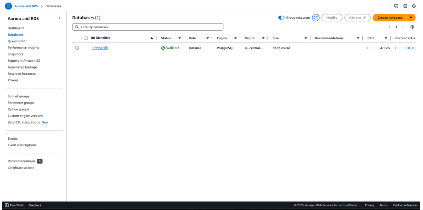
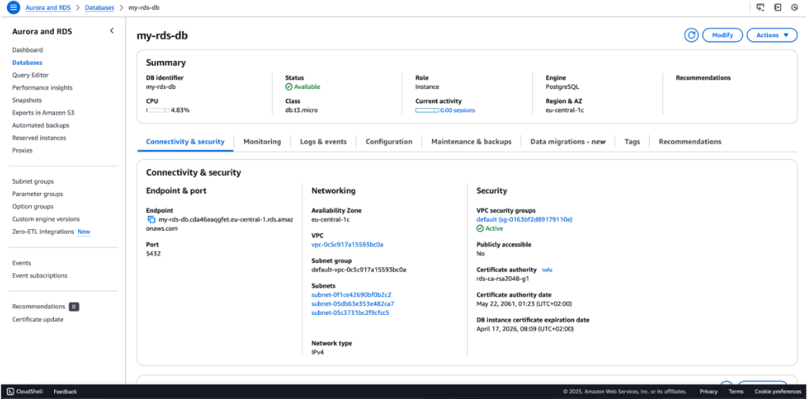
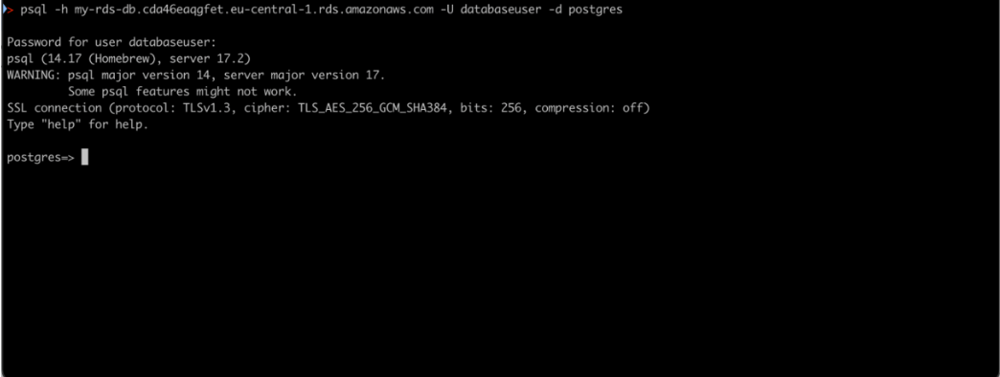
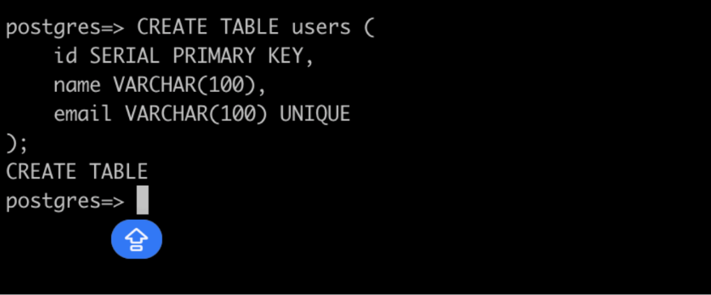
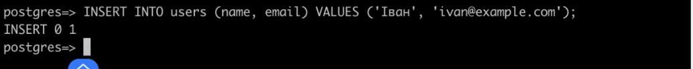
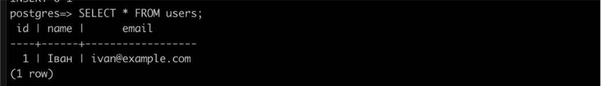
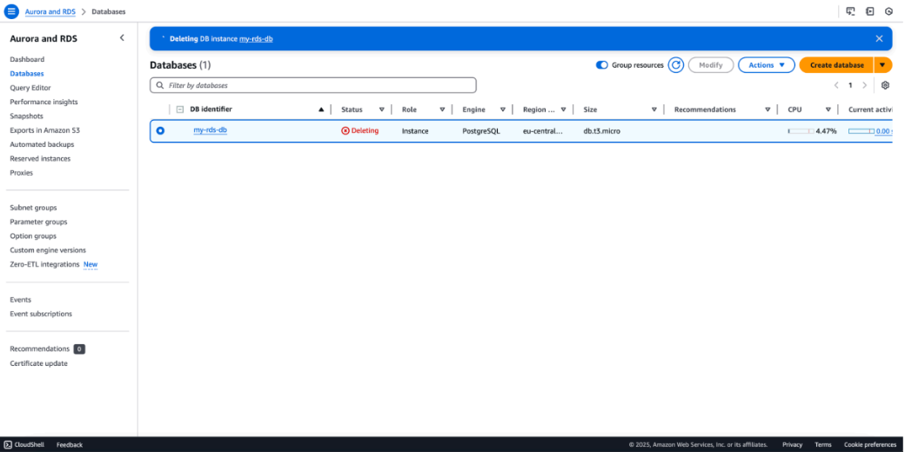

[📄 Download Lab Report as PDF](./pdf/AWS-RDS-PostgreSQL-Setup.pdf)

# AWS Cloud Lab: Provisioning and Managing a Secure Amazon RDS Database

This repository contains a step-by-step documentation of a cloud infrastructure project where I deployed and managed a relational database using Amazon RDS, focusing on security best practices, data integrity, and resource management.

---

## **Task 1: Provisioning an Amazon RDS Instance**
### **Overview**
In this step, I deployed a managed relational database using Amazon RDS (Relational Database Service). Using a managed service instead of manual installation on an EC2 instance reduces operational overhead and ensures better reliability.

### **Technical Specifications**
**Database Engine:** PostgreSQL (an open-source object-relational database).
**Instance Class:** `db.t3.micro` (ideal for testing and low-traffic applications within the Free Tier).
**Storage:** 20 GB General Purpose SSD (gp3).
**Region:** `eu-central-1` (Frankfurt).

### **Why this matters for Security & Operations:**
**Managed Updates:** AWS handles OS patching and database software updates, reducing the risk of vulnerabilities.
**Isolation:** By placing the database in a specific subnet, we can control traffic using Security Groups, ensuring that only authorized applications can connect to it.
**Scalability:** The `t3.micro` instance is a cost-effective starting point, but RDS allows for easy scaling as data requirements grow.

*Screenshot 1: The RDS Database showing an 'Available' status in the AWS Console.*

---

## **Task 2: Identifying the Database Endpoint**
### **Overview**
To connect any application to the database, we need its Endpoint. Think of the endpoint as the specific "home address" of your database on the internet (or within your private network).

### **Key Details**
**Endpoint:** This is a DNS name (e.g., `my-rds-db...eu-central-1.rds.amazonaws.com`).
**Port:** Default for PostgreSQL is `5432`.

### **Security Perspective**
Finding the endpoint is only the first step. In a secure environment:
1. **Private Access:** The endpoint should ideally not be reachable from the public internet.
2. **Firewall (Security Groups):** Even if someone has the endpoint address, they cannot connect unless their IP address is explicitly allowed in the AWS Security Group rules.

*Screenshot 2: The Connectivity & Security tab displaying the DNS endpoint and VPC security groups.*

---

## **Task 3: Connecting via Command Line (psql)**
### **Overview**
Now that the database is running and the endpoint is known, I established a connection using `psql`, the command-line interface for PostgreSQL. This step verifies that the database is reachable and accepting connections.

### **The Command**
I used the following command structure to log in: `psql -h <endpoint> -U <username> -d postgres`.

### **Security & Educational Note**
* **Encrypted Connection:** As seen in the screenshot, the connection uses SSL (TLSv1.3). This is crucial for cybersecurity because it encrypts the data in transit, preventing attackers from "sniffing" your database password or data over the network.
* **Authentication:** Access is granted only after providing the correct password for the database user.

*Screenshot 3: Terminal output confirming a successful SSL-encrypted connection to the PostgreSQL database.*

---

## **Task 4: Creating the Database Schema**
### **Overview**
Once connected, I defined the database structure by creating a table named `users`. This sets the foundation for how data will be stored and organized.

### **Table Structure Breakdown**
* `id`: A unique identifier for each user, automatically incremented (`SERIAL PRIMARY KEY`).
* `name`: Stores the user's name (up to 100 characters).
* `email`: Stores the email address with a `UNIQUE` constraint.

### **Security & Best Practices**
* **Data Integrity:** The `UNIQUE` constraint on the email field is a critical security and operational feature. It prevents duplicate accounts and ensures that each user has a distinct identity.
* **Least Privilege:** Defining specific data types (like `VARCHAR(100)`) instead of unlimited text helps optimize performance and prevents certain types of buffer-related issues.

*Screenshot 4: Executing the CREATE TABLE query in the psql interface.*

---

## **Task 5: Populating the Database (Data Entry)**
### **Overview**
To verify that the database structure is functional, I inserted a test record into the `users` table. This step confirms that the system correctly handles write operations and follows the defined constraints.

### **The Query**
I executed the following command to add a new user: `INSERT INTO users (name, email) VALUES ('Іван', 'ivan@example.com');`.

### **Cybersecurity Note**
In a real-world application, data is never inserted directly like this from a user form. To prevent **SQL Injection** attacks, developers must use Parameterized Queries (Prepared Statements) to ensure that malicious code cannot be executed through input fields.

*Screenshot 5: Successful execution of the INSERT statement.*

---

## **Task 6: Querying and Verifying Data**
### **Overview**
The final step is to retrieve the data from the database to ensure it was stored correctly. I used the `SELECT` statement, which is the primary tool for reading data in SQL.

### **The Query**
I executed: `SELECT * FROM users;`.

### **Technical Results**
The terminal successfully displayed the record for "Іван" with his email and the automatically assigned ID of 1. This confirms that the RDS instance is not only accepting connections but is actively storing and retrieving data as expected.

### **Cybersecurity Tip**
From a security standpoint, it is best practice to select only the specific columns you need (e.g., `SELECT name FROM users;`) rather than using `SELECT *`. This reduces the amount of sensitive data being sent over the network and minimizes the risk of accidental information disclosure.

*Screenshot 6: The terminal displaying the successfully stored data record.*

---

## **Task 7: Resource Cleanup (Deleting the RDS Instance)**
### **Overview**
The final step of this laboratory work was the secure decommissioning of the cloud resources. Deleting unused instances is a fundamental practice in cloud management to avoid unnecessary costs and minimize security risks.

### **Why this matters for Cybersecurity & Operations:**
* **Cost Management:** In a professional environment, "zombie" resources (unused but active) can lead to massive unexpected bills.
* **Security Hygiene:** Every active resource is a potential target. Deleting an instance after a project is finished ensures that an unmonitored database doesn't become a vulnerability in the future.
* **Compliance:** Proper disposal of data and resources is a requirement for many security frameworks (like SOC2 or ISO 27001).

*Screenshot 7: Initiating the deletion of the database instance in the AWS Console.*