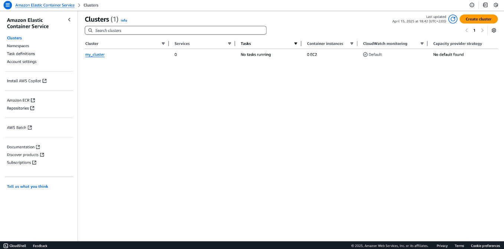
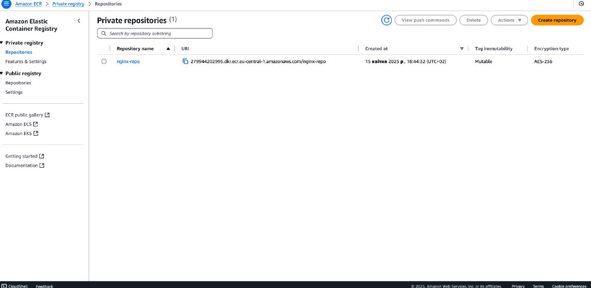
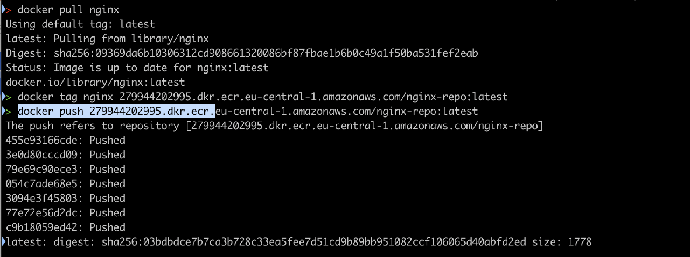
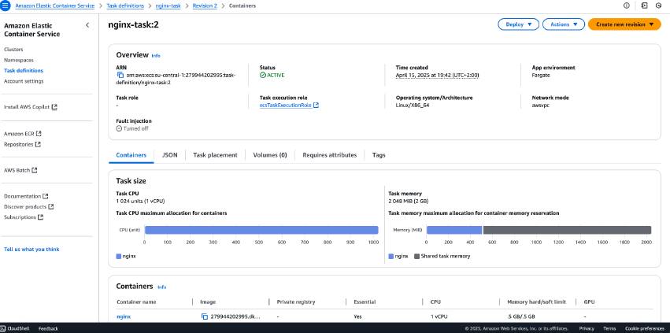
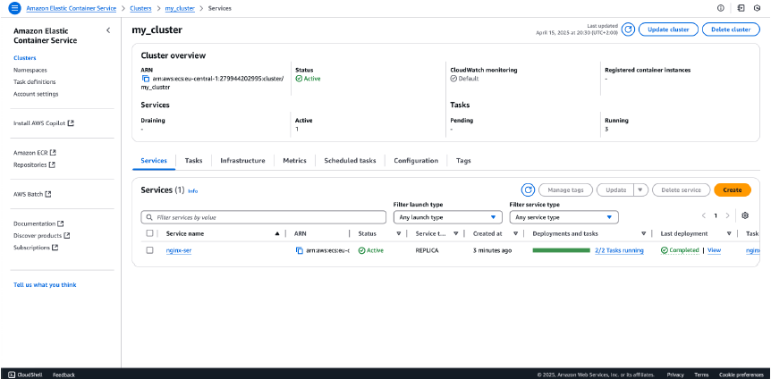
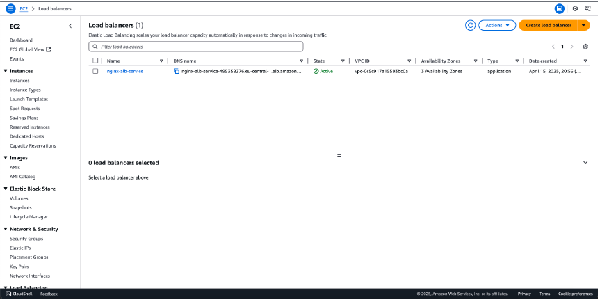
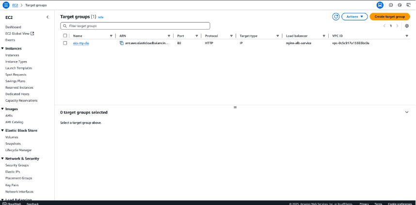

# AWS Cloud Lab: Deploying a Scalable Nginx Web Server on Amazon ECS

[📄 Download Lab Report as PDF](./pdf/LAB-ECS-Nginx.pdf)

This repository contains a step-by-step documentation of a cloud infrastructure project where I deployed a containerized Nginx web server using Amazon ECS, ECR, and an Application Load Balancer.

---

## **Step 1: Cluster Orchestration with Amazon ECS**
### **What are we doing?**
[cite_start]In this initial phase, I provisioned an **Amazon Elastic Container Service (ECS)** cluster named `my_cluster`[cite: 3]. [cite_start]This serves as the foundational logical grouping of resources required to run containerized applications[cite: 4].

### **Security & Educational Highlights**
* [cite_start]**Infrastructure Strategy:** The cluster is configured to support **AWS Fargate** (serverless), which is preferred from a security standpoint as it abstracts server management and reduces the attack surface[cite: 7, 8].
* [cite_start]**Control Plane vs. Data Plane:** Understanding that ECS acts as the Control Plane, while the Fargate tasks act as the Data Plane[cite: 9].

*Screenshot 1: The created ECS cluster in the AWS Management Console.*

---

## **Step 2: Secure Image Management with Amazon ECR**
### **What are we doing?**
[cite_start]I established a **Private Repository** within **Amazon Elastic Container Registry (ECR)** named `nginx-repo`[cite: 40]. [cite_start]This acts as a secure Docker registry for our application images[cite: 41].

### **Security & Educational Highlights**
* [cite_start]**Encryption at Rest:** The repository uses **AES-256 encryption** to ensure images are protected while stored[cite: 44, 66].
* [cite_start]**Private Access:** By using a private registry, the application logic remains inaccessible to the public internet[cite: 48].

*Screenshot 2: Private ECR repository configured with encryption.*

---

## **Step 3: Container Image Preparation and Deployment**
### **What are we doing?**
[cite_start]Using the **Docker CLI**, I pulled the official Nginx image, retagged it for AWS, and securely pushed it to my private ECR repository[cite: 77, 79].

### **Security & Educational Highlights**
* [cite_start]**Supply Chain Integrity:** By moving the image to a private ECR, I created a "Golden Image" repository, reducing reliance on public registries[cite: 84].
* [cite_start]**Layered Security:** Each layer pushed can be analyzed for vulnerabilities[cite: 86, 87].

*Screenshot 3: Terminal output showing successful Docker authentication and image push.*

---

## **Step 4: Creating the Blueprint (Task Definition)**
### **What are we doing?**
[cite_start]I created a **Task Definition** named `nginx-task`, which acts as the "blueprint" for our container, defining how much power and which image to use[cite: 112, 113].

### **Security & Educational Highlights**
* [cite_start]**Limited Resources:** I allocated exactly **1 vCPU and 512 MB of Memory**[cite: 118]. [cite_start]This ensures that the container cannot consume excessive cloud resources if compromised[cite: 125].
* [cite_start]**Isolation:** Using Fargate ensures that each task runs in its own isolated environment[cite: 127, 156].

*Screenshot 4: Task Definition settings including Fargate launch type and port mappings.*

---

## **Step 5: Launching the Service (Making it Live)**
### **What are we doing?**
[cite_start]I created an **ECS Service** named `nginx-ser` to manage the running tasks[cite: 177]. [cite_start]I set the **Desired Tasks to 2** to ensure the website stays online even if one container fails[cite: 180].

### **Security & Educational Highlights**
* [cite_start]**High Availability:** Running multiple tasks prevents a "Denial of Service" (DoS) if one instance fails[cite: 187, 188].
* [cite_start]**Automatic Recovery:** The service monitors container health and automatically replaces unhealthy ones[cite: 189, 190].

*Screenshot 5: ECS Service showing 2/2 tasks running successfully.*

---

## **Step 6: Setting up the Application Load Balancer (ALB)**
### **What are we doing?**
[cite_start]I created an **Application Load Balancer** named `nginx-alb-service` to act as the single point of entry for users[cite: 233, 238].

### **Security & Educational Highlights**
* [cite_start]**Hiding Infrastructure:** The ALB acts as a shield, hiding the private IP addresses of my containers from the public internet[cite: 241, 242].
* [cite_start]**DDoS Protection:** Using AWS ALB provides a native layer of protection against common network attacks[cite: 245].

*Screenshot 6: The ALB in an "Active" state with its DNS name.*

---

## **Step 7: Configuring the Target Group**
### **What are we doing?**
[cite_start]I configured a **Target Group** named `ecs-my-clu` to bridge the Load Balancer and the ECS tasks[cite: 284].

### **Security & Educational Highlights**
* [cite_start]**Tightened Access:** This setup ensures that containers only accept traffic coming directly from the Load Balancer, preventing bypass attacks[cite: 293, 294].
* [cite_start]**Health Monitoring:** The system continuously verifies that containers are healthy before sending traffic to them[cite: 291].

*Screenshot 7: Target Group linking the Load Balancer to the ECS service.*