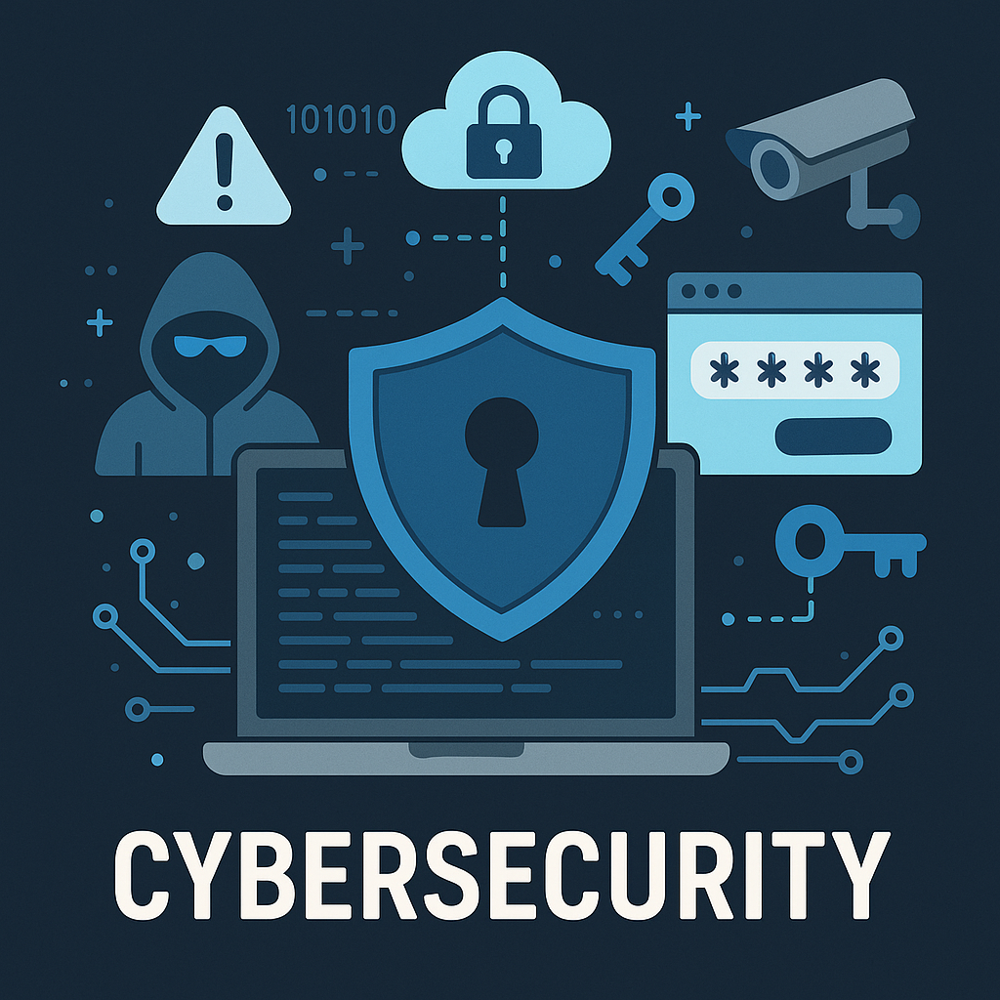

# 🔒 Cybersecurity Portfolio



Welcome to my cybersecurity portfolio! This repository showcases my journey into cybersecurity through hands-on labs, certifications, and practical experience in defending against cyber threats.

## 📋 Table of Contents

- [About](#about)
- [Certifications](#certifications)
- [Projects & Experience](#projects--experience)
- [Skills & Technologies](#skills--technologies)
- [Labs](./Labs/) - 📁 [View Labs Directory](./Labs/)
- [Learning Path](#learning-path)
- [Contact](#contact)

## 🎯 About

This portfolio represents my ongoing journey in cybersecurity, featuring practical experience, certifications, and real-world simulations. I'm passionate about protecting digital assets and understanding the ever-evolving threat landscape.

## 🏆 Certifications

### Cloud Security
- **AWS EC2 Basics** - AWS Course Completion Certificate
- **AWS Skill Builder** - AWS Skill Builder Course Completion Certificate

### Cybersecurity Fundamentals
- **Google Cybersecurity Certificate** - Coursera
  - Foundations of Cybersecurity
  - Play It Safe: Manage Security Risks

### Professional Development
- **Deloitte Australia Cyber Job Simulation** - Forage (July 2025)
  - Completed comprehensive job simulation involving web activity log analysis
  - Supported client during cyber security breach response
  - Identified suspicious user activity through log analysis

## 🛠️ Projects & Experience

### Deloitte Cyber Security Simulation
**July 2025** | *Forage Platform*

- **Log Analysis**: Analyzed web activity logs to identify potential security threats
- **Incident Response**: Supported client during active cyber security breach
- **Threat Detection**: Successfully identified suspicious user activities and patterns
- **Documentation**: Created comprehensive analysis reports for stakeholders

### Security Log Analysis
- **Log Reading Guide**: Developed documentation on how to effectively read and analyze security logs
- **Pattern Recognition**: Implemented techniques for identifying anomalous behavior in system logs

## 💻 Skills & Technologies

### Security Domains
- **Incident Response** - Log analysis, threat detection, breach response
- **Cloud Security** - AWS EC2, cloud infrastructure protection
- **Risk Management** - Security risk assessment and mitigation strategies
- **Threat Analysis** - Identifying and analyzing suspicious activities

### Technical Skills
- **Log Analysis** - Web activity logs, security event monitoring
- **AWS Services** - EC2, cloud security best practices
- **Security Tools** - Various cybersecurity analysis tools and platforms
- **Documentation** - Technical writing and security reporting

## 🧪 Labs

This section contains hands-on cybersecurity labs and practical exercises that demonstrate real-world security scenarios and defensive techniques.

**📁 [View Labs Directory](./Labs/)**

*Note: Labs are organized by category and difficulty level. Each lab includes documentation, walkthroughs, and learning objectives.*

## 📚 Learning Path

My cybersecurity journey includes:

1. **Foundation Building** - Google Cybersecurity Certificate program
2. **Cloud Security** - AWS training and certification
3. **Practical Application** - Deloitte job simulation and real-world scenarios
4. **Continuous Learning** - Ongoing skill development and threat landscape awareness

## 🔗 Repository Structure

```
cybersecurity-portfolio/
├── CERTIFICATES/
│   ├── aws/                    # AWS certifications
│   ├── Google Coursera/        # Google cybersecurity certificates
│   └── Deloitte Australia/     # Professional simulation certificate
├── Labs/                       # Hands-on cybersecurity labs and exercises
├── logs/                       # Security log analysis resources
└── README.md                   # This file
```

## 📞 Contact

- **GitHub**: [Your GitHub Profile]
- **LinkedIn**: [Your LinkedIn Profile]
- **Email**: [Your Email Address]

---

*This portfolio is continuously updated as I progress in my cybersecurity career. Feel free to explore the projects and reach out if you'd like to discuss cybersecurity topics or opportunities.*